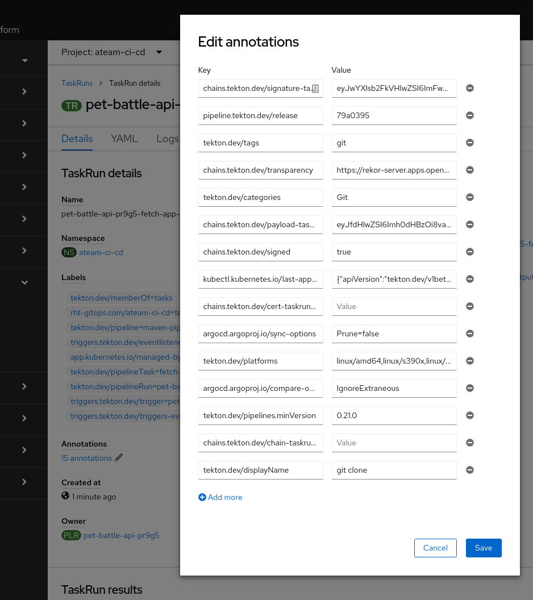

# tekton chains demo

## deploy rekor

Grab the latest rekor and deploy it in your cluster:

- https://github.com/sigstore/rekor/releases/

```bash
export CLUSTER_DOMAIN=$(oc get ingress.config/cluster -o 'jsonpath={.spec.domain}')

cat <<EOF | oc -n openshift-gitops apply -f-
apiVersion: argoproj.io/v1alpha1
kind: Application
metadata:
  name: rekor
spec:
  destination:
    # Define name or server, not both
    name: ""
    namespace: rekor-server
    server: https://kubernetes.default.svc
  source:
    path: helm-charts/rekor
    repoURL: https://github.com/sigstore/sigstore-helm-operator
    targetRevision: HEAD
    helm:
      valueFiles:
        - values.yaml
      values: |-
        server:
          ingress:
            hostname: rekor-server.${CLUSTER_DOMAIN}
            annotations:
              route.openshift.io/termination: "edge"
  project: default
  syncPolicy:
    automated:
      prune: true
      selfHeal: true
    syncOptions:
      - CreateNamespace=true
EOF
```

Allow your argocd controller access if it doesn't have it already:

```bash
oc adm policy add-cluster-role-to-user admin system:serviceaccount:openshift-gitops:openshift-gitops-argocd-application-controller -n rekor-server
```

## deploy tekton chains

You need OpenShift piplelines / Tekton deployed already.

```bash
kustomize build tekton-chains | oc apply -f-
```

Add missing rbac:

```bash
oc adm policy add-cluster-role-to-user admin system:serviceaccount:tekton-chains:chains-secrets-admin -n tekton-chains
oc adm policy add-scc-to-user anyuid -z tekton-chains-controller
```

Create a password protected secret

```bash
cosign generate-key-pair k8s://tekton-chains/signing-secrets
```

Check the chains ConfigMap:

```bash
kind: ConfigMap
metadata:
  name: chains-config
data:
  artifacts.oci.storage: oci
  artifacts.taskrun.format: in-toto
  artifacts.taskrun.storage: tekton
  transparency.enabled: 'true'
  transparency.url: 'https://rekor-server.apps.openshift-cluster.com'
```

## checking it all works

Run a tekton pipeline. Tasks and images should be signed and Attested.



The data is in the annotations e.g.

Grab the signature

```bash
TASK=pet-battle-api-sbw8r-kube-linter-gnx5r
#TASK=--last
export TASKRUN_UID=$(tkn -n ateam-ci-cd tr describe ${TASK} -o  jsonpath='{.metadata.uid}')
tkn -n ateam-ci-cd tr describe $TASK -o jsonpath="{.metadata.annotations.chains\.tekton\.dev/signature-taskrun-$TASKRUN_UID}" > signature
tkn -n ateam-ci-cd tr describe $TASK -o jsonpath="{.metadata.annotations.chains\.tekton\.dev/payload-taskrun-$TASKRUN_UID}" | base64 -d > payload
```

Verify the signature

```bash
cosign verify-blob --key k8s://tekton-chains/signing-secrets --signature ./signature ./payload
```

See the raw Annotation

```bash
curl https://rekor-server.apps.openshift-410-kwlrb.demo.redhatlabs.dev/api/v1/log/entries?logIndex=8
```

Decode Annotation

```bash
rekor-cli  --rekor_server=https://rekor-server.apps.openshift-410-kwlrb.demo.redhatlabs.dev get --log-index=8 --format json | jq -r .Attestation | base64 -d | yq -P e -
```